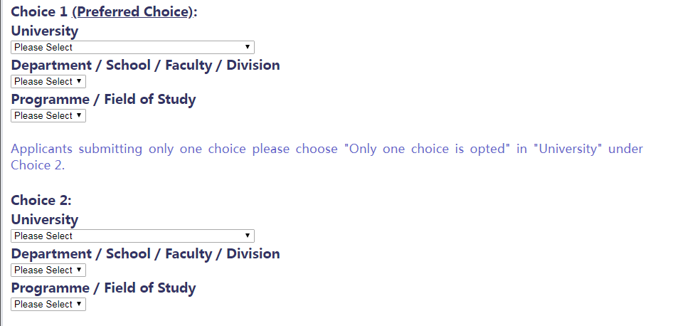

# 香港博士/研究型硕士的奖学金主要分为两大类型

__一．最常见的奖学金就是Postgraduate Scholarship（PGS）（不能和HKPF同时持有）__
基本所有的港校都会为博士或者研究型硕士提供这类奖学金，以港大2020/21为例子，每年奖学金是港币207，960元（每个月大概港币17,330元）（2019年9月1日起）, 过了一年的probation之后，会涨到17，810港币。这个奖学金在递交申请的时候，会有选项让申请者勾选的。（我问过相关同事，学生在套中香港的教授后，一般也会商量一下经费问题，如果导师表示有经费，那么学生在提交申请的时候则可以勾选这个选项）。
申请方式：不需要额外申请，在申请系统勾选Postgraduate Scholarship

__二．Hong Kong PHD Fellowship（HKPF）__
以下主要分享一下 Hong Kong PHD Fellowship---香港政府提供的奖学金
1，	什么是香港政府奖学金呢
研究资助局于2009年成立「香港博士研究生奖学金计划」。此项计划旨在吸引世界各地优秀的研究生，来港在受教资会资助大学修读以研究为本的博士学位课程。
2，	University Postgraduate Fellowship金额是多少呢
针对2020/21学年入学的学生：将为获奖的博士生提供每年港币309,600元（每个月大概港币25,800元）的津贴，及每年港币12,900元的会议及研究活动交通津贴，为期三年。于2020/21学年（香港各大学的学年一般于每年九月开始）将会选250名获奖申请人。如获奖者修读年期多于三年，大学可提供额外资助，详情请向有关大学查询。
3，	 香港University Postgraduate Fellowship Scheme支持哪些大学
8所，分别是香港城市大学，香港浸会大学，香港岭南大学，香港中文大学，香港大学教育学院，香港理工大学，科技香港大学，香港大学

4，	我有资格获得University Postgraduate Fellowship吗
凡有志报读香港受教资会资助大学全日制博士学位研究课程的人士，不论国籍、工作经验和种族背景，均可申请。
虽然卓越的学业成绩是评选时的先决条件，但遴选小组亦会根据以下四项标准，作为本计划的主要评选准则：
学术表现（很关键）
研究能力/潜质（很关键）
沟通技巧
领导才能

我也进去港理工看了一下其对HKPF的要求描述是： 
a.  来自国内排名前30的高校
b. 个人年级排名靠前，GPA优异
c.  TOEFL或者 IETLS成绩优异
d. 有各种奖励或竞赛奖项
e.  对来自各个学校精英班的学生会优选考虑。
总结来说就是---“四好学生”：学习好，英语好，研究好，个人素质好。

5，	University Postgraduate Fellowship Scheme的申请流程是
申请必须通过香港博士奖学金计划电子系统提交（仅提供基本信息，例如其姓名和出生地），系统将分配一个HKPFS编号，申请人在申请入读所选大学时需要输入该编号。而且，申请HKPFS无需申请费。

第一步：初步申请
在Research Grants Council of Hong Kong网站提交一个初步申请，里面需要选择两所学校作为自己的志愿（申请人可以选择1或2间学校的2个项目/学院。申请中会要求申请者注明优先顺序。）

提交初步申请后会得到一个Reference Number，务必保存好。初步申请的时间为：每年的9月1日至12月2日。（每年具体时间还需要再查询官网确认）
2020/21的信息是：
香港城市大学：2019年12月2日
香港浸会大学：2019年12月2日（香港时间11:59pm）
岭南大学：2019年12月2日（香港时间11:59pm）
香港中文大学：2019年12月2日（香港时间5:00pm）
香港教育大学：2019年12月2日
香港理工大学：2019年12月2日（香港时间11:59pm）
香港科技大学：2019年12月2日（香港时间11:59pm）
香港大学：2019年12月2日（香港时间11:59 pm）

第二步：学校申请
提交了初步申请后，还需要在学校的截止时间前提交一个学校的申请。这个跟平常申请学校没什么两样，按照学校的要求和流程提交网申和申请材料即可。需要注意的是记得填入初步申请获得的Reference Number。而在正式网申的时候，需要在你所选的学校项目上填写几个有关HKPF的问题（每个限制字数200-300字英文），教授面试也会问，问题如下：
A.	在香港学PHD的原因？
B.	长期职业计划，今后发展？
C.	对香港日后的研究以及社会的贡献？
注意1：由于初步申请和学校申请的截止时间相差不远，所以一定要尽早提交初步申请，给学校申请预留充足时间。　　
　　

第三步：学校提名
个人申请结束后，学校内会有初步筛选，确定最终提名的人选。通过这一步的申请人会被以学校的名义推荐到HKPFS评审委员会中。根据不同学校的规定，学校在筛选过程中可能会要求申请人参与面试（一般是Skype面）。面试的内容主要是为什么要读博，你的研究经历、研究兴趣、研究计划等。学校大概会在一月份确定提名人选。
注意2：HKPFS申请完不是直接送到RGC审查，是需要学校推荐的。
　
第四步：最终确定
HKPFS获奖人最终是由Research Grants Council of Hong Kong的评选委员会确定的，委员会通常由相关领域的专家学者组成，学校推荐之后他们会最后定夺。这一阶段一般不会再有面试等考核，所以学校的提名非常重要。评选委员会确定最终人选后，一般会先反馈给学校，再由学校通知申请人。

6，	HKPFS的结果何时公布
HKPFS 2020/21的结果将于2020年4月公布

最后，还有两种奖学金是专属于港大的，分别是
University Postgraduate Fellowship（UPF）（不能和HKPF同时持有）
这个奖学金项目只在香港大学提供。只有少部分优秀的博士生才能拿到的奖学金。奖学金的总金额为港币70,000元，是三大类奖学金中最少的。这个奖学金无需单独申请，学校会自动考虑评选的。但是申请者需要在在第一轮（即是每年十二月一号）就要递交了。
申请方式：不需要额外申请，在申请系统勾选University Postgraduate Fellowships

此外，我在查看港大官网的时候，还发现了一个只针对港大的新的奖学金叫做
HKU Presidential PhD Scholarship (HKU-PS)
为了吸引来自世界各地的顶尖候选人到香港大学攻读博士学位，香港大学推出了HKU Presidential PhD Scholarship (HKU-PS)。
第一年的奖学金高达港币约404,000元，而接下来每年则可以获得港币约384,000元的奖学金。
申请方式：不需要额外申请，将从HKPF获奖人中选拔HKU-PS的获奖者。原则上，所有HKPF获奖者都将获得HKU-PS。
